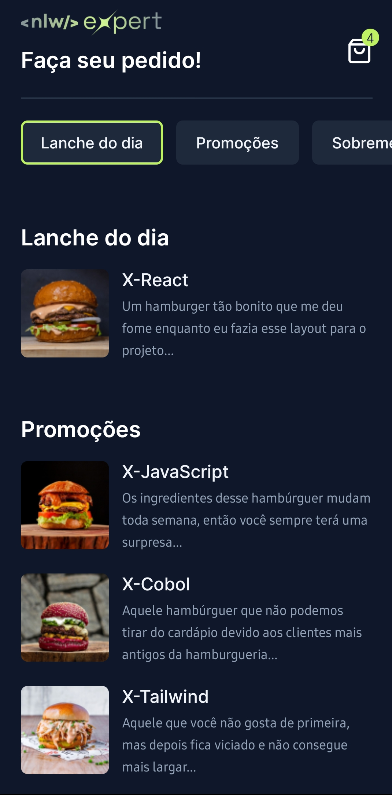

# MyLunch - Best Food Delivery for your Commerce

Built with the Next.js 13.5 Expo, Expo Router, React Native, TypeScript & Tailwind

{ width=12.75rem height=20.25rem }

## Features

- 🛠️ Complete Food Commerce Built
- 💳 Free & Pro Plan Using Stripe
- 🎨 Clean, Modern UI Using Nativewind
- 🚀 Optimistic UI Updates for a Great UX
- 🔤 100% written in TypeScript
- 🎁 ...much more

# How can U test: 

## 1. Install dependencies

```bash
npm i
```

## 2. Run the app

```bash
npx expo start
```

## License

[MIT](https://choosealicense.com/licenses/mit/)

[John Moura](https://jovimoura.vercel.app/)
